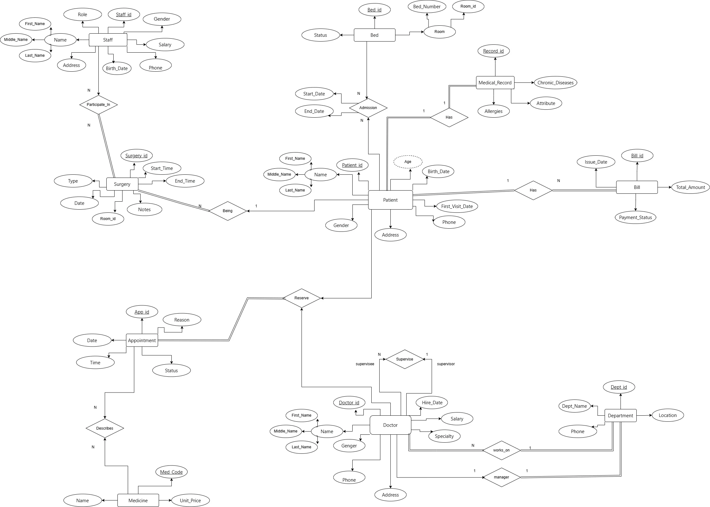
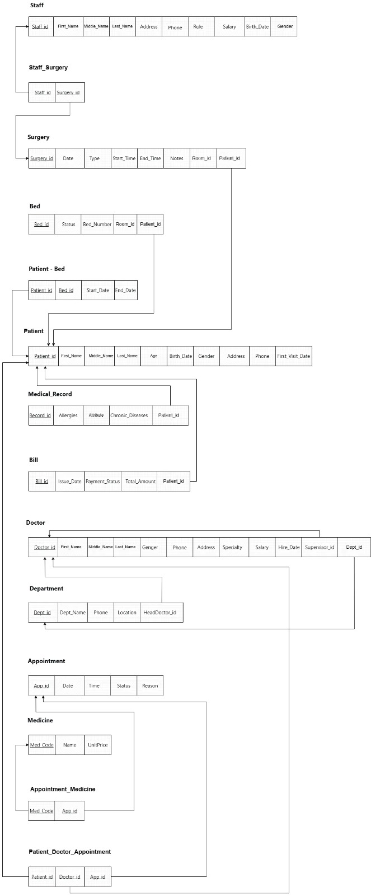

# 🏥 Hospital Database System

A relational database project designed to manage and organize hospital operations, including patients, doctors, appointments, surgeries, billing, and related medical information.

---

## 📌 Project Overview

The **Hospital Database System** is a relational database designed to organize and manage hospital information efficiently.

The system models different aspects of hospital operations and establishes relationships between the main entities to maintain data consistency and reduce redundancy.

The database includes information related to:

* Patients
* Doctors
* Appointments
* Surgeries
* Billing
* Medical information
* Hospital-related records

---

## 🎯 Objectives

The main objectives of this project are to:

* Design a structured relational database for a hospital.
* Identify the main entities and their relationships.
* Create an Entity-Relationship Diagram (ERD).
* Convert the database design into relational tables.
* Define primary keys and foreign keys.
* Maintain data integrity and consistency.
* Use SQL to create and manage the database.
* Demonstrate practical database design and SQL skills.

---

## 🗃️ Database Entities

The database consists of several entities representing different hospital operations.

### 👤 Patients

Stores information about patients registered in the hospital.

Patient information can be connected to appointments, medical records, surgeries, and billing information.

### 👨‍⚕️ Doctors

Stores information about doctors working in the hospital.

Doctors can be associated with patients, appointments, and medical procedures.

### 📅 Appointments

Represents scheduled appointments between patients and doctors.

Appointments allow the system to track when patients are scheduled to receive medical services.

### 🏥 Surgeries

Stores information related to surgical procedures performed in the hospital.

Surgery records can be associated with patients and medical staff.

### 💳 Billing

Manages financial information related to hospital services and patient billing.

---

## 🔗 Database Relationships

The database uses relational connections between its entities through **Primary Keys (PK)** and **Foreign Keys (FK)**.

The relationships allow information to be connected across different parts of the hospital system while maintaining data integrity.

Examples include:

```text
Patients
   │
   ├──────── Appointments ──────── Doctors
   │
   ├──────── Surgeries
   │
   └──────── Billing
```

The complete database structure is illustrated in the ERD included in this repository.

---

## 📐 Entity Relationship Diagram

The Entity-Relationship Diagram represents the main entities, attributes, and relationships within the hospital database.

### ERD



---

## 🧩 Database Schema

The relational schema provides a more detailed representation of the database tables and their relationships.

### Schema



---

## 🛠️ Technologies

* **MySQL**
* **SQL**
* **Relational Database Design**
* **ERD / Database Modeling**

---

## 📁 Project Structure

```text
Hospital-Database-System/
│
├── README.md
├── hospital.sql
├── erd.webp
├── schema.jpeg
└── .gitignore
```

---

## 🚀 Getting Started

### 1. Clone the Repository

```bash
git clone https://github.com/balsamkhaleel/Hospital-Database-System.git
```

### 2. Navigate to the Project

```bash
cd Hospital-Database-System
```

### 3. Open MySQL

Open your preferred MySQL environment, such as:

* MySQL Workbench
* MySQL Command Line
* Another compatible MySQL client

### 4. Create the Database

Open the `hospital.sql` file and execute the SQL statements in your MySQL environment.

The SQL file contains the database structure and SQL commands required to create the system.

---

## 🗄️ Database Design

The project follows a relational database approach where information is divided into related tables.

The design uses:

* **Primary Keys** to uniquely identify records.
* **Foreign Keys** to establish relationships between tables.
* Relational constraints to maintain data integrity.
* Structured tables to reduce unnecessary data duplication.

---

## 📊 SQL Operations

The database can be used to perform common operations such as:

* Creating database tables.
* Inserting hospital records.
* Retrieving patient information.
* Managing doctor information.
* Managing appointments.
* Tracking surgeries.
* Managing billing information.
* Joining related tables.
* Filtering and sorting records.

---

## 💡 Key Features

* 🏥 Hospital information management
* 👤 Patient management
* 👨‍⚕️ Doctor management
* 📅 Appointment management
* 🏨 Surgery records
* 💳 Billing management
* 🔗 Relational database design
* 🔑 Primary and foreign key relationships
* 📐 ERD and database schema documentation

---

## 🔮 Future Improvements

Possible improvements for future versions include:

* Adding a graphical user interface.
* Creating a web-based hospital management system.
* Adding authentication and user roles.
* Adding more detailed medical records.
* Implementing stored procedures and triggers.
* Adding automated reporting.
* Adding database backup and recovery functionality.
* Connecting the database to a backend application.
* Adding an API for external applications.


